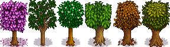

# Fruit Tree Seasons

Fruit Tree Seasons is a Stardew Valley mod that changes how fruit trees display their seasons.

This mod makes fruit trees in greenhouses (and other indoor areas that lack seasons) take on the
appearance of whichever season they bear fruit in, rather than always using their summer
appearance. Fruit trees on Ginger Island (and other outdoor areas that lack seasons) will still use
the tree's summer appearance.

This mod also fixes a bug in the appearance of the leaves that come down from fruit trees when
they're shaken; instead of using leaves for the current season (regardless of the tree's appearance)
the game now uses the leaf texture for the season the fruit tree is currently displayed as.

This mod should be fully compatible with mods that add custom fruit trees.

If a modded tree bears fruit in multiple seasons, the appearance chosen by default is the first
one in the following list: summer, spring, fall, winter. By default, modded fruit trees that bear
fruit in winter will use their spring appearance instead.

## Installation

This mod requires [SMAPI](https://github.com/Pathoschild/SMAPI).

You can download Fruit Tree Seasons from the [releases
page](https://github.com/Esper89/StardewValley-FruitTreeSeasons/releases/latest), below the
changelog.

To install Fruit Tree Seasons, just extract the zip file and place the `Fruit Tree Seasons` folder
into your `Mods` folder.

## Configuration

Running Stardew Valley with Fruit Tree Seasons installed will generate `config.json` (in
`Fruit Tree Seasons`). You can edit this file to configure the mod; make sure to restart the game
afterwards for your changes to be applied.

The `Seasons` field is the order to apply season appearances; the first season on this list that a
fruit tree bears fruit in is the one that will apply to the tree. Fruit trees that do not bear fruit
in *any* of the listed seasons will be ignored by this mod. This field defaults to
`["Summer", "Spring", "Fall", "Winter"]`, because summer appearances are the game's default and
spring appearances tend to look nicer than fall appearances. Removing seasons from this list is
allowed but not recommended; it's best to just change the order.

The `MapSeasons` field lets you display the wrong season for fruit trees depending on the season
they bear fruit in. For example, if `MapSeasons` were set to `{ "Summer": "Winter" }`, then any
fruit tree that bears fruit in summer would display their *winter* appearances in greenhouses. This
field defaults to `{ "Winter": "Spring" }`, because trees without leaves don't look very nice in the
greenhouse.

If you'd also rather not see fall appearances for trees in your greenhouse, just add
`"Fall": "Summer"` to your `MapSeasons`.

## Building

To build Fruit Tree Seasons, run `dotnet build` in the project's root directory. The output will be
automatically installed into your Stardew Valley mods directory.

To build Fruit Tree Seasons in release mode, run `dotnet build --configuration Release`. This will
also create a `.zip` file for easy distribution.

## License

Copyright © 2025 Esper Thomson

This program is free software: you can redistribute it and/or modify it under the terms of version
3 of the GNU Affero General Public License as published by the Free Software Foundation.

This program is distributed in the hope that it will be useful, but WITHOUT ANY WARRANTY; without
even the implied warranty of MERCHANTABILITY or FITNESS FOR A PARTICULAR PURPOSE. See the GNU Affero
General Public License for more details.

You should have received a copy of the GNU Affero General Public License along with this program.
If not, see <https://www.gnu.org/licenses>.

Additional permission under GNU AGPL version 3 section 7

If you modify this Program, or any covered work, by linking or combining it with Stardew Valley (or
a modified version of that program), containing parts covered by the terms of its license, the
licensors of this Program grant you additional permission to convey the resulting work.
